# 📝 Reflection of the Study - [2025.05.18]

## 1. 📌 학습 주제
- 언리얼 엔진 설치
- 뷰포트 탐색 및 액터 사용
- C++ vs 블루프린트트

## 2. 🧠 배운 내용 정리

### ✔️ 언리얼 엔진 설치
- 에픽게임즈 설치 & 로그인 (https://store.epicgames.com/en-US/download)
- 언리얼 엔진 다운로드 (에픽 게임즈 런처에서 다운로드할 수 있다.)
- (언리얼 엔진 실행할 때 그래픽 드라이버의 버전 오류가 발생해서 버전에 맞게 다시 다운로드 하였다. https://www.nvidia.com/en-us/drivers/)

### ✔️ 뷰포트 탐색
-  초록색 버튼을 누르면 프로그램을 실행하여 캐릭터를 조작할 수 있다.
- 마우스 우클릭을 눌러 시점을 고정하고 상하좌우, 위아래로 시점을 조절할 수 있다.

### ✔️ 액터
- 좌클릭을 눌렀을 때 테두리 생기는 것이 액터. 
1. 다양한 종류의 액터 생성 가능. 

    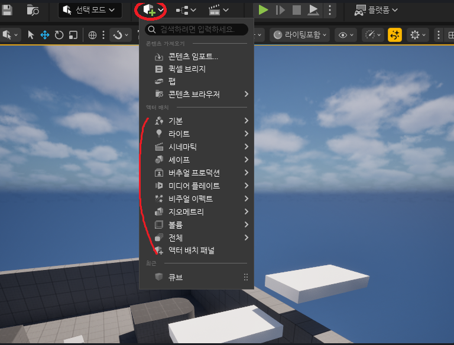
2. 좌측 상단의 툴을 이용해 배치, 크기조정, 이동 등을 할 수 있다.
 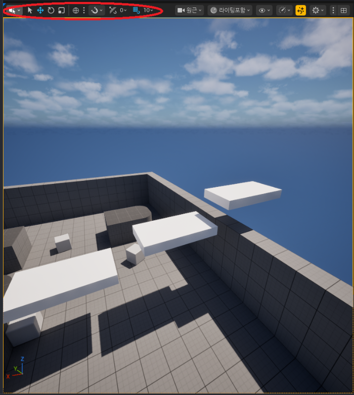

### ✔️ 블루프린트 vs C++
- 블루프린트 
    - 언리얼 전용 
    - 수정이 빠르고 쉬움
    - 내장 툴 존재

- C++
    - 업계 표준
    - 간결하고 빠른 속도
    - 모든 기능 영역에 접근 가능 & 대형 프로젝트에 유리

### ✔️ 문제 해결 방법
- 무엇을 시도하였는지 명시
- 문제 해결을 위한 시도 명시
- 결과로 예상한 것 & 실제 결과
- 에러 메세지 및 로그 공유

### ✔️ Warehouse Wreckage 개요
- physics 다루기
- 다양한 발사체 스폰하기
- 발사체 조준하기
- BXP 툴로 레벨 빌드하기
- 레벨 reload하기

1.  Content Drawer

    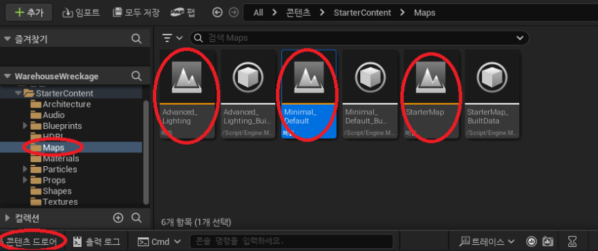
    -  왼쪽 아래 콘텐츠 드로어에 들어가면 프로젝트의 콘텐츠를 파일 형태로 확인 가능
    - StarterContent의 Maps에 들어가면 초기 설정된 레벨을 확인할 수 있다
    - 이때 레벨은 노란색 줄이 표시된 것이다

2. Blue Print 
     - 블루프린트 열기  
        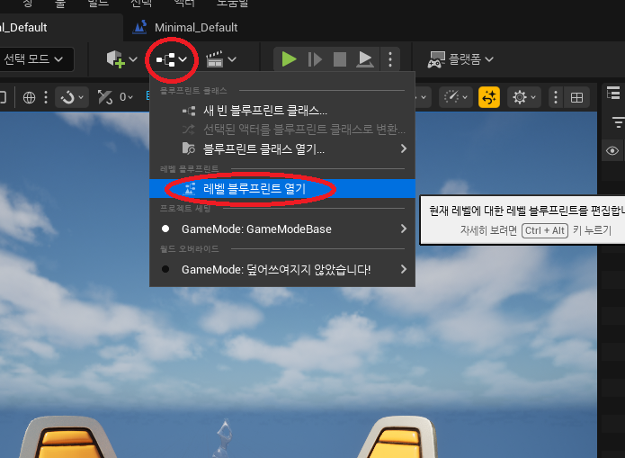
     - 용어
        - Event Graph - blueprint 화면
        - Node - 블루프린트에서 사용가능한 미리 만들어진 기능
        - Event - 사건을 발생시키는 정보를 가지고 있는 노드
        - Pin - 노드를 연결할 수 있는 소켓
            - input - 언제 노드 실행할지
            - output - 무엇을 실행할지
        - Connection - input, output 핀을 연결하는 선
     
     - 블루프린트 작성 및 실행
        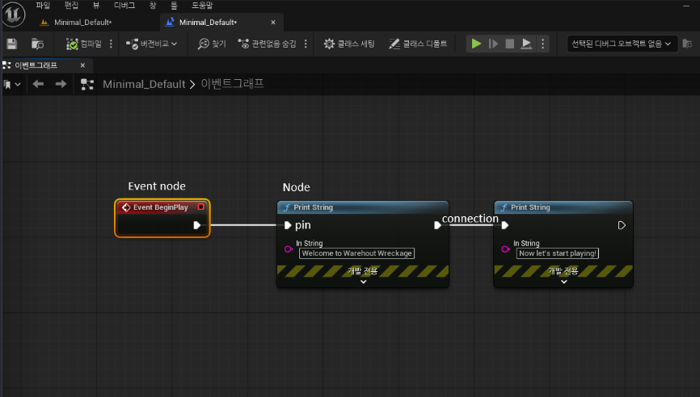
        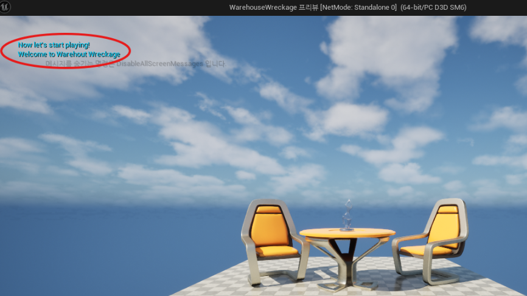

    - Physics Simulation
    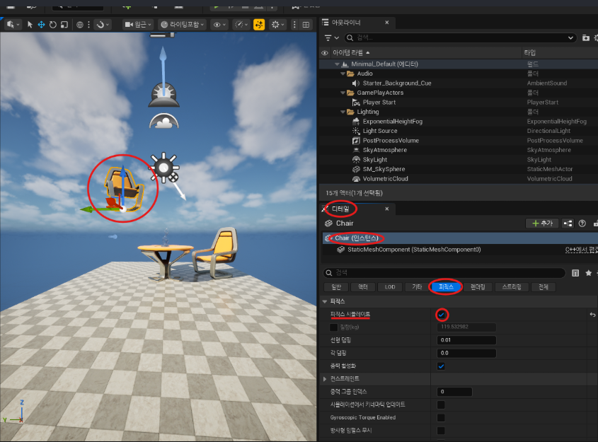
    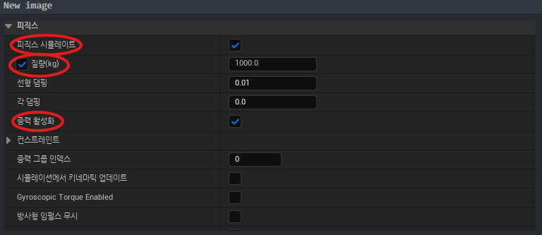
        - 액터 선택 -> 디테일 -> 피직스 -> 조건 조정
    
    - 실습 이미지

        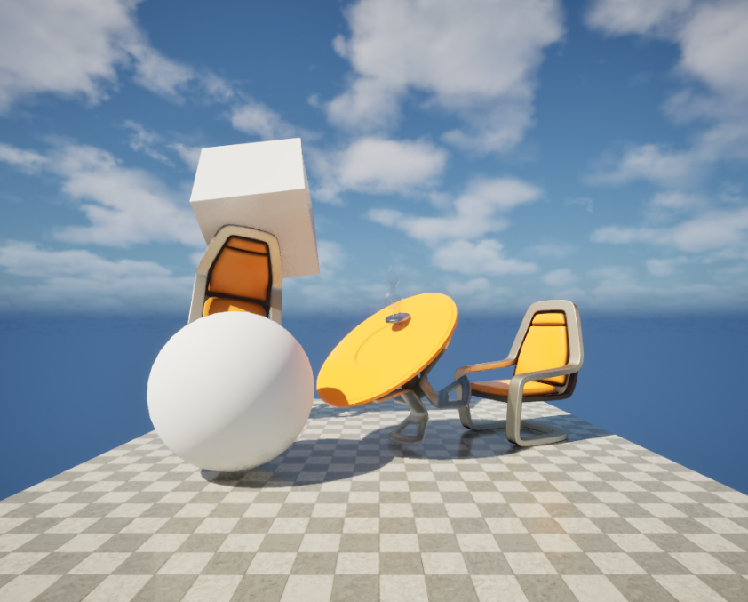

### ✔️ Object & Reference
- 용어 
    - Objects - 데이터와 기능의 집합
    - Actors - 레벨에 들어가는 오브젝트
    - Component - 엑터에 들어가는 오브젝트
    - Reference - 오브젝트를 찾는 위치
    - Data Pin - 노드의 입/출력 데이터
    - Execution Pins - 노드를 언제 실행할지 결정

- 블루프린트 구성 & 실행 화면
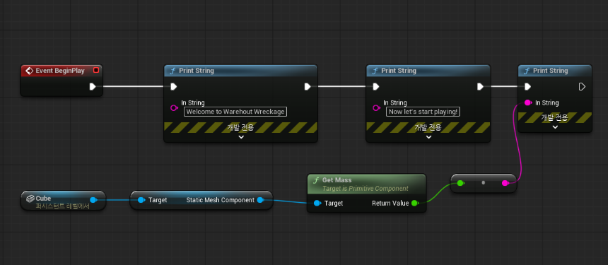
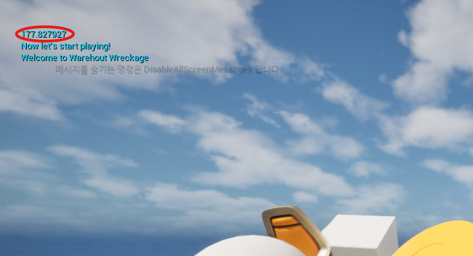

### ✔️ 블루프린트 클래스 & 인스턴스
1. 액터 선택 -> 블루프린트 생성 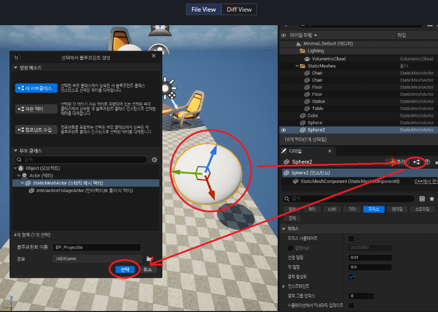
2. 콘텐츠 드로어 -> 생성한 블루프린트 클래스를 레벨에 드래그 -> 같은 블루프린트의 새로운 액터(인스턴스) 추가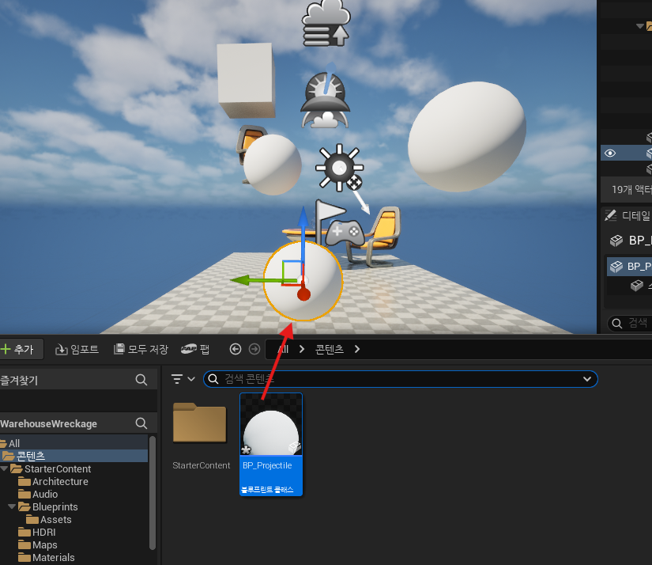
3. 블루프린트 수정 

    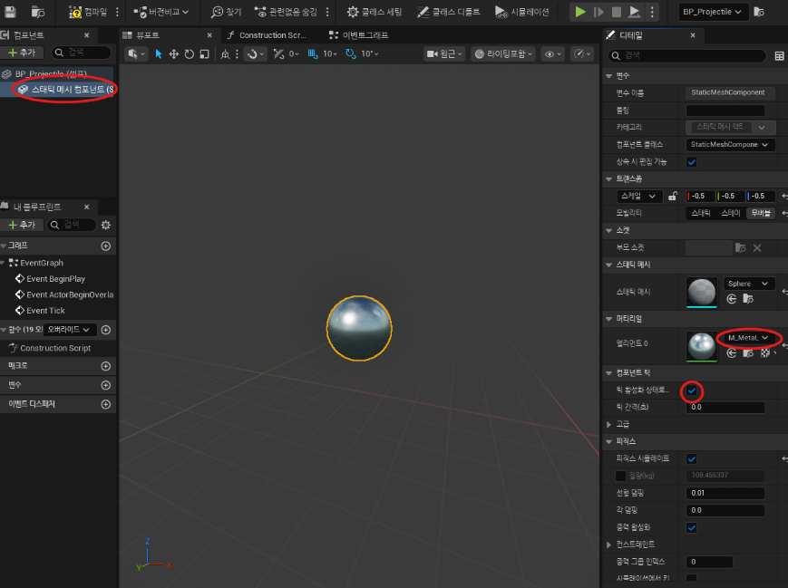
4. 결과 

    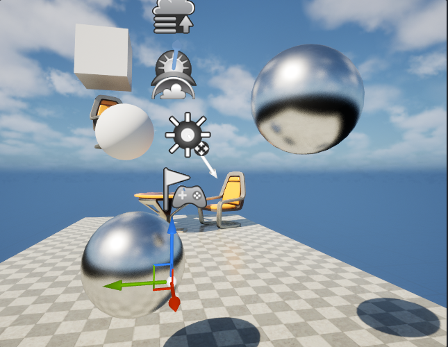

### ✔️ 액터 스폰
- 용어
    - Spawning - 실행 중 오브젝트를 만드는 것
    - Transform - 위치, 회전, 스케일 
    - Return Pin - 노드 출력

    1. Space Bar event에 BP_Projectile 블루프린트 클래스 연결
    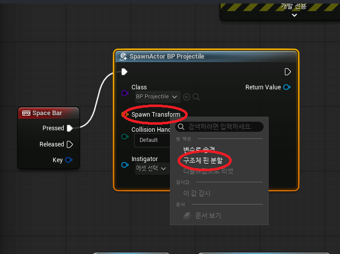
    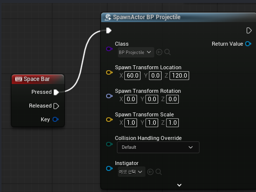
    2. 실행 결과
    
        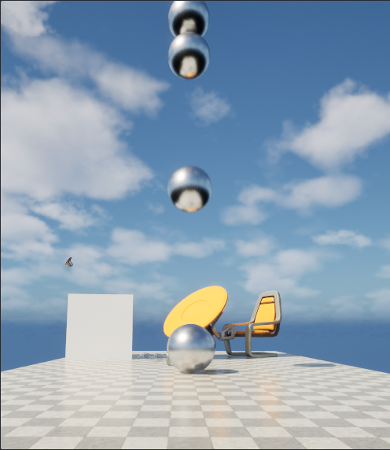