# 📝 Reflection of the Study - [2025.06.17]

## 1. 🧠 배운 내용 정리

### ✔️ 함수
- 코드 정리를 위한 기능 중 하나인 코멘트부터 살펴본다
- 
     - 발사체를 스폰하는 기능을 코멘트로 묶는다
     - 하지만 여전히 보기 어렵다. 함수 기능이 더욱 유리하다.

- 함수 사용 방법
    - 함수로 묶을 부분을 모두 잡기 -> 우클릭 -> 함수로 접기
    - 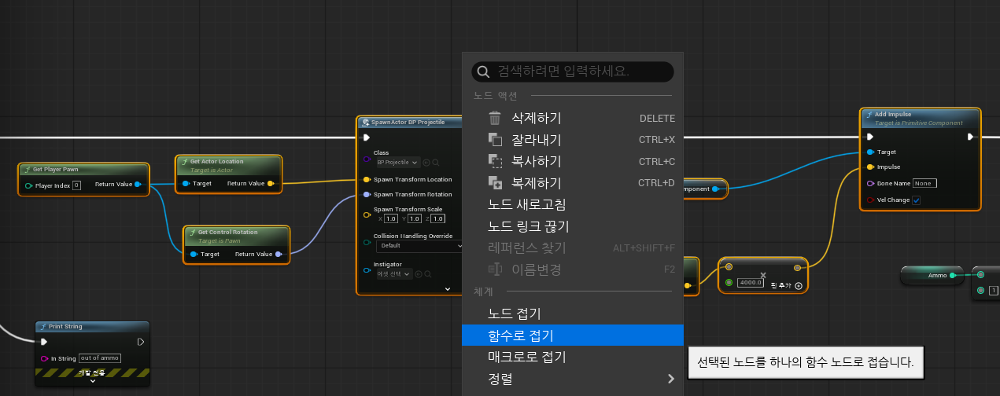
    - 결과!
    -  
    
    - 필요한 부분을 모두 함수화 시킨 결과
    -  

- 함수 만들기
    - 함수 -> + -> 함수 이름 작성
    - 만들어진 함수를 이벤트 그래프에 드래그 앤 드랍

- 함수의 입력값 설정
    - Test1 (벡터)로 설정 -> 만들어진 입력값을 동작 함수에 이어주기 
    - 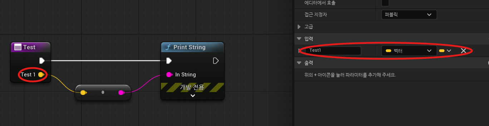
    - Has Ammo 함수 생성 (Ammo 값이 1 이상일때만 공 던질 수 있도록 하는 함수)

- 함수의 Side Effect
    - 함수에 식별가능한 효과가 있을 때 Side Effect가 있다고 한다. (ex. setAmmo, Print String etc)
    - Side Effect가 없으면 Pure Function(순수함수)이라고 부른다. (ex. get Ammo) -> 실행 핀이 필요 없다.
    - 만들어진 함수의 실행 핀 없애기 
    - 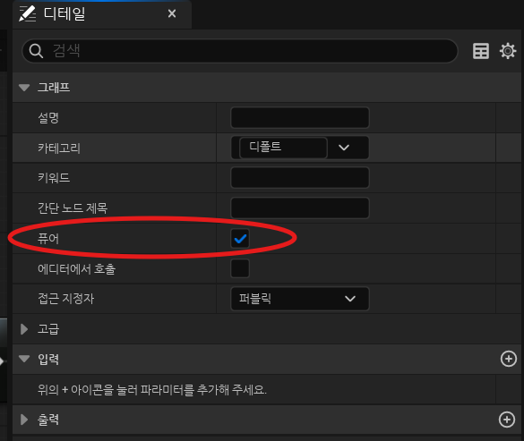

- 순수 함수 vs 비순수 함수
    - 동사형식 -> 비순수
    - 함수 내에서 동작이 없는 비교적 간단한 함수가 순수 함수
    
- 객체 지향 프로그래밍 
    - 함수가 조작하는 데이터와 함께 존재

- 멤버 함수
    - 클래스의 함수. 항상 특정 인스턴스에서 호출된다.
    - BP projectile로 객지프 실습
    - 컨텐츠 드로어 -> bp projectile -> 풀 블루프린트 에디터 열기
    - 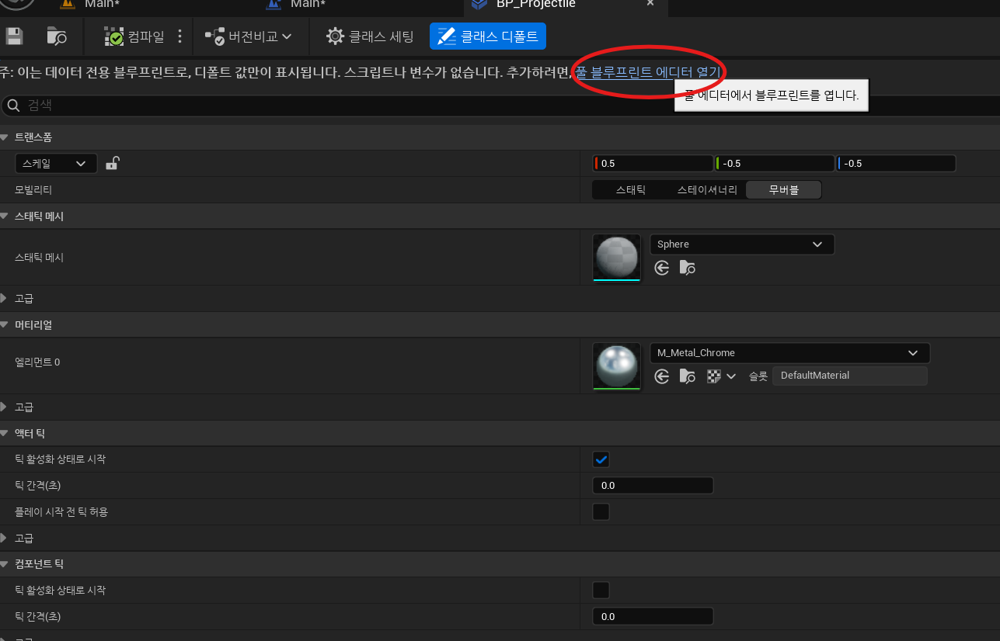
    - BP projectile의 my blueprint에서 Print Your Name 함수 만들고 Spaw Projectile에서 함수 만들어 연결하기.
    - 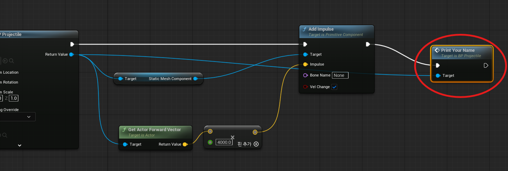
    - 여기서 Print Your Name 함수에 Target이라는 입력에 연결이 됐다. 하지만 실제로 Print Your Name 함수에는 특정한 입력값 설정이 없다. 그런데 왜?
    - 모든 멤버 함수는 현재 타겟에 대한 파라미터를 암묵적으로 가짐.
    - 즉, 해당 파라미터(self)는 인스턴스에 대한 정보를 가지고 있음
    - 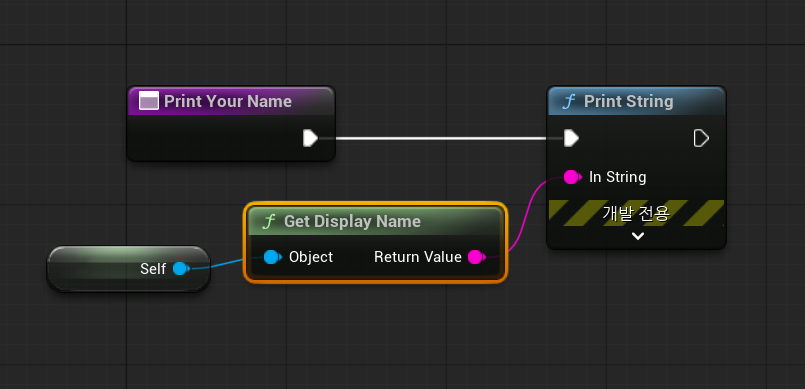
    - 따라서 이렇게 self 호출해서 인스턴스에 대한 정보를 받아올 수 있다.

- self
    - 멤버 함수에서 사용할 수 있는 노드
    - 현재 인스턴스를 가리키고 있다.
    - Launch 멤버 함수 만들기
    - 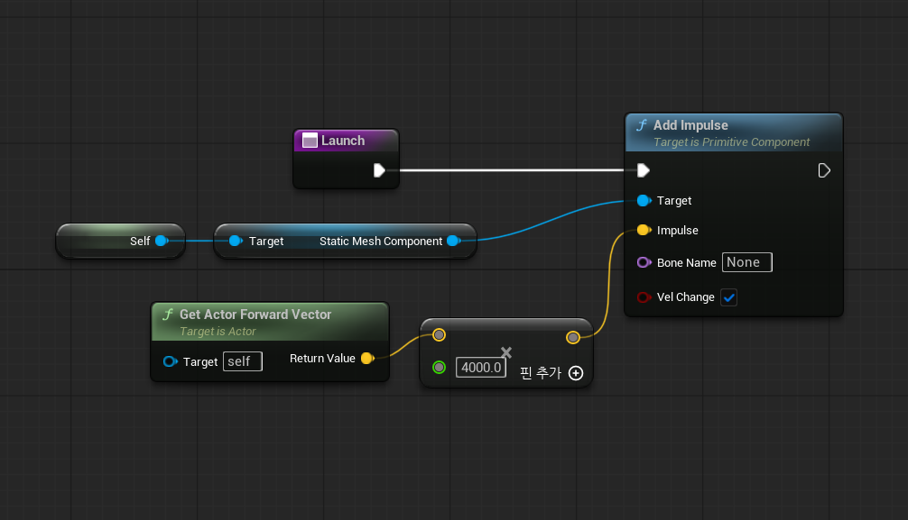
    - Static Mesh Component는 현재 BP Projectile에 대해 

### ✔️ 레벨 로드와 지연 노드

- 레벨 로드
    - Open Level (By name) : 현재 레벨 이름을 이용해 블루프린트 재실행
    - 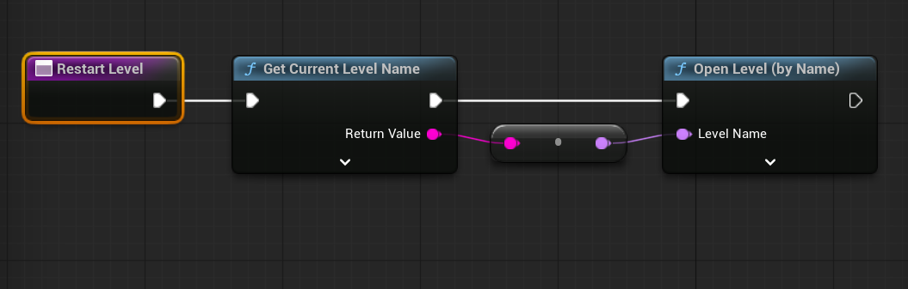

- 지연 노드
    - Delay : 지정한 시간만큼의 딜레이를 가지고 output 출력
    - 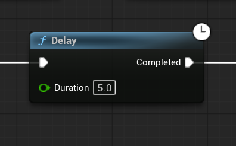

### ✔️ 프로젝트 셋업
- Unreal Learning Kit 
- Stylized Character Kit

- 캐릭터 넣기
    - 기본 제공되는 블루프린트를 레벨에 넣기

- 실행 시 시점을 만든 캐릭터로 설정 
    - 자식 블루프린트 생성 (content 하위로 생성)
    - 기존 플레이어 시작지점 지우고 auto possess 활성화
    - 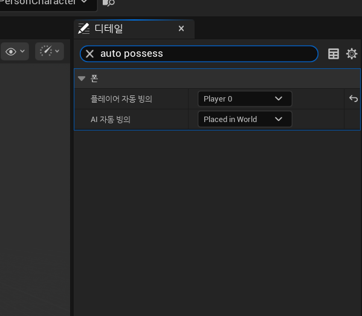

- 플레이어 동작 오류 해결
    - 마우스로 시점 좌우로 변경 못함 -> ThirdPersonCharacter 블루프린트 들어가 설정 변경
    - 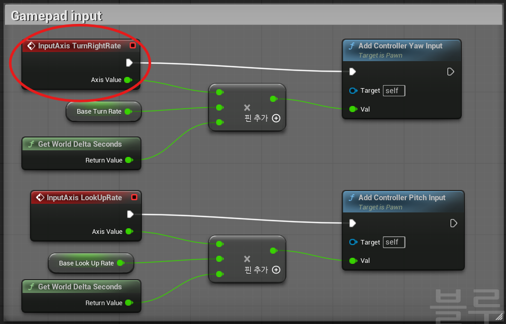
    - 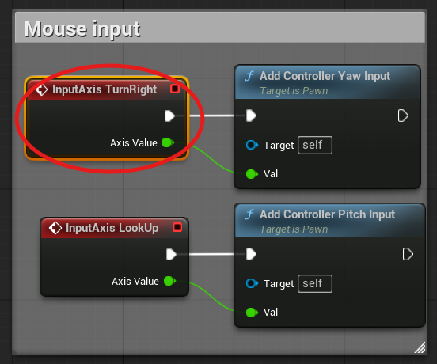
    
- 플레이어 커스터마이징
    - 메시 컴포넌트 조정 
    - 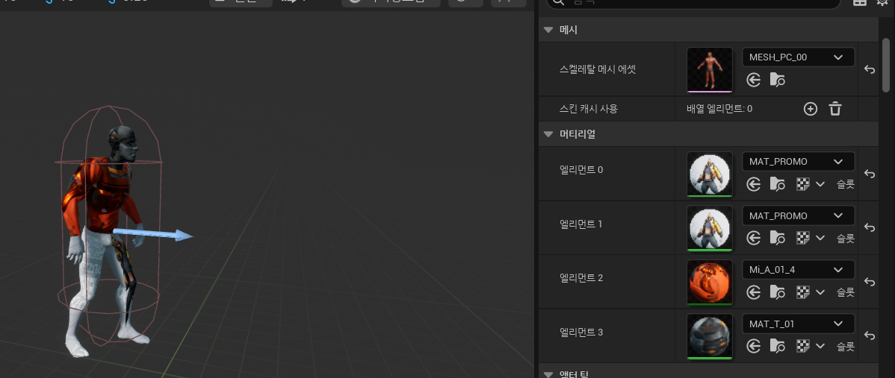